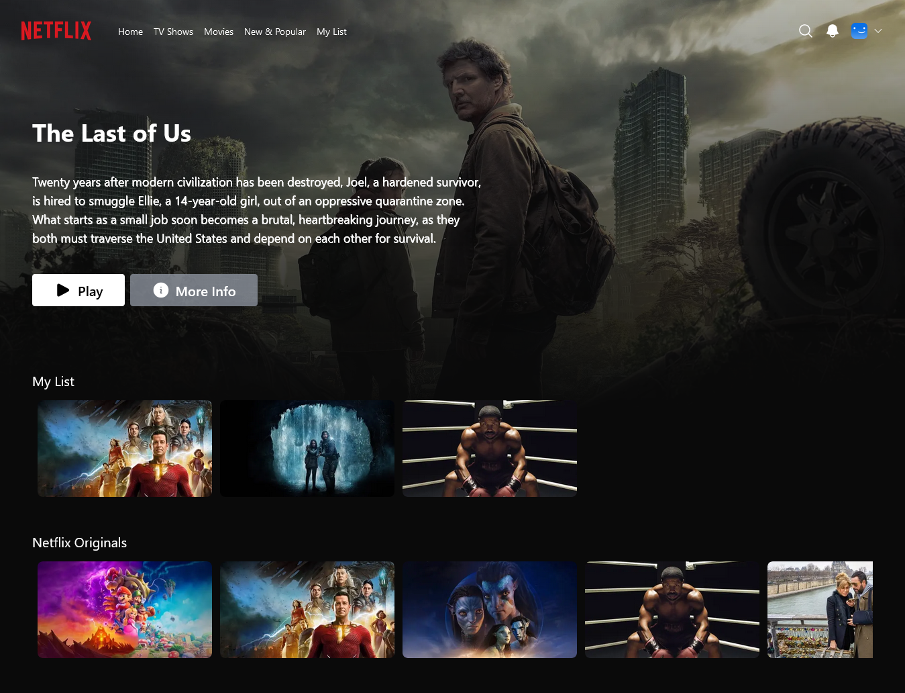
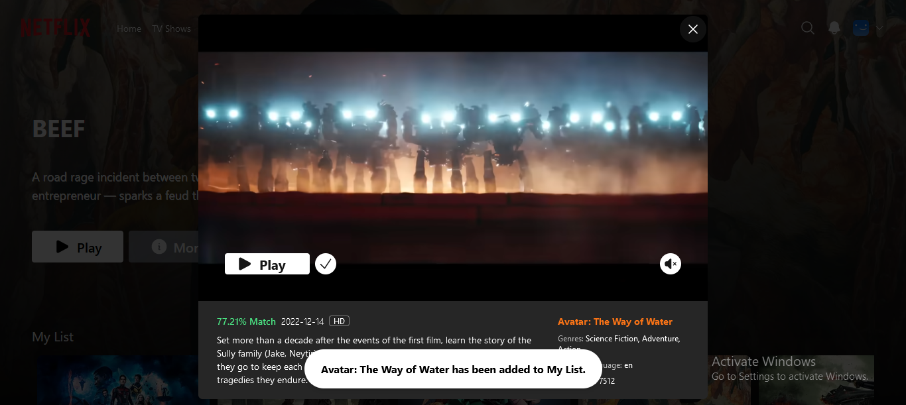
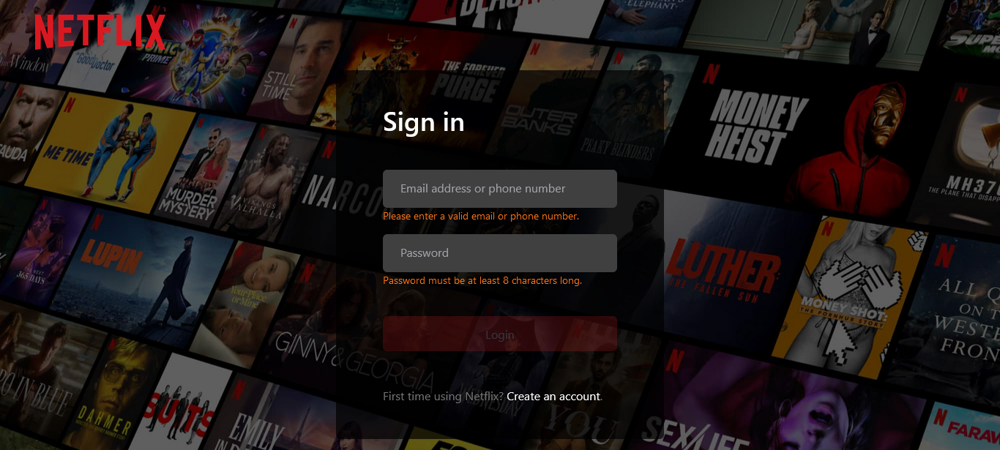

# Dynamic Netflix clone using TMDB API





### Overview

This is a fullstack Netflix clone built using React and Next.js, MongoDB and Prisma for data management, Tailwind CSS for styling, NextAuth.js for authentication , and TMDB API for getting the latest movie data.

---

Users are able to:

- View the optimal layout for the site depending on their device's screen size
- See hover states for all interactive elements on the page
- Create an account
- Login using their credentals
- Scroll lists of categorised movies
- Open individual movies in a modal that dispays varios information and plays a trailer
- Add movies to favorites

---

### Built with

- [Next.js](https://nextjs.org/)
- [React](https://react.dev/)
- [Typescript](https://www.typescriptlang.org/)
- [MongoDB](https://www.mongodb.com/)
- [NextAuth.js](https://next-auth.js.org/)
- [Prisma](https://www.prisma.io/)
- [Redux](https://redux.js.org/)
- [Tailwind CSS](https://tailwindcss.com/)
- [TMDB API](https://www.themoviedb.org/)

---

## Getting Started

### First install all dependencies using:

```bash
npm install
```

### Then setup .env file

```bash
NEXT_PUBLIC_TMDB_API_KEY=

DATABASE_URL=

NEXTAUTH_JWT_SECRET=

NEXTAUTH_SECRET=
```

### Finaly, run the development server:

```bash
npm run dev
```

Open [http://localhost:3000](http://localhost:3000) with your browser to see the result.
